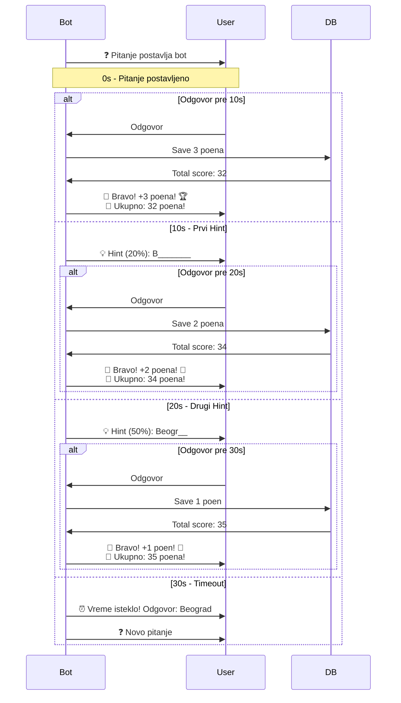

# 🎯 Uklanjanje Hint Kolone & Ukupan Skor

## 📝 Šta je Promenjeno

### 1. Uklonjena Hint Kolona iz Baze
- ❌ **Obrisana** `hint` kolona iz `quiz_questions` tabele
- ✅ **Hintovi se generišu automatski** na osnovu odgovora
- 🤖 **Bot automatski pokazuje**:
  - **10s**: Hint (20% slova)
  - **20s**: Hint (50% slova)
  - **30s**: Preskače na sledeće pitanje

### 2. Ukupan Skor u Poruci
- 🎉 Nova poruka nakon tačnog odgovora:
  ```
  🎉 Bravo, marko! Dobili ste 3 poena! 🏆
  💯 Ukupno: 32 poena!
  ```

## ✨ Nove Funkcionalnosti

### Automatski Hintovi
```typescript
// 10 sekundi - 20% slova
💡 Hint (20%): B______ K________

// 20 sekundi - 50% slova
💡 Hint (50%): Beogr__ K________
```

### Ukupan Skor
```typescript
// Primer poruke:
🎉 Bravo, marko! Dobili ste 3 poena! 🏆
💯 Ukupno: 32 poena!

// Ako je 1 poen:
🎉 Bravo, ana! Dobili ste 1 poen! 🥉
💯 Ukupno: 5 poena!
```

## 🔧 Tehničke Izmene

### 1. SQL Migration Script

**`remove-hint-column.sql`**:
```sql
-- Remove hint column from quiz_questions table
ALTER TABLE quiz_questions
DROP COLUMN IF EXISTS hint;
```

### 2. TypeScript Type Update

**`lib/supabase.ts`**:
```typescript
export type QuizQuestion = {
  id: number;
  question: string;
  answer: string;
  // hint: string | null; ❌ REMOVED
  category: string | null;
  difficulty: 'lako' | 'srednje' | 'teško' | null;
  created_at: string;
};
```

### 3. Nova Funkcija za Dohvatanje Skora

**`lib/quizBot.ts`**:
```typescript
// Get user's current total score
async function getUserTotalScore(username: string): Promise<number> {
  try {
    const { data, error } = await supabase
      .from('user_scores')
      .select('total_points')
      .eq('username', username)
      .single();

    if (error || !data) return 0;
    return data.total_points;
  } catch (error) {
    console.error('Error getting user score:', error);
    return 0;
  }
}
```

### 4. Ažurirana Poruka Čestitanja

**`lib/quizBot.ts`**:
```typescript
// Calculate points
const points = calculatePoints(timeElapsed);

// Save score to database
await saveUserScore(username, points);

// Get total score after saving
const totalScore = await getUserTotalScore(username);

// Message with points
let pointsEmoji = '';
if (points === 3) pointsEmoji = '🏆';
else if (points === 2) pointsEmoji = '🥈';
else if (points === 1) pointsEmoji = '🥉';

await postBotMessage(
  `🎉 Bravo, ${username}! Dobili ste ${points} ${points === 1 ? 'poen' : points < 5 ? 'poena' : 'poena'}! ${pointsEmoji}\n💯 Ukupno: ${totalScore} ${totalScore === 1 ? 'poen' : totalScore < 5 ? 'poena' : 'poena'}!`
);
```

## 📋 Kako Primeniti Izmene

### 1. Push Kod na GitHub

```bash
cd chat-app
git add -A
git commit -m "Remove hint column and add total score to messages"
git push origin main
```

### 2. Primeni SQL Migration

U **Supabase SQL Editor**:

```sql
-- Remove hint column
ALTER TABLE quiz_questions
DROP COLUMN IF EXISTS hint;
```

### 3. Redeploy na Vercel

Izmene će se automatski deployovati nakon push-a na GitHub.

## 🎨 Kako Radi

### Proces Odgovaranja



## 📊 Bodovanje

### Points System

| Vreme | Hint | Poeni | Emoji |
|-------|------|-------|-------|
| 0-10s | Bez hinta | 3 | 🏆 |
| 10-20s | 20% hint | 2 | 🥈 |
| 20-30s | 50% hint | 1 | 🥉 |
| 30s+ | Timeout | 0 | ⏰ |

### Hint Generation

**Funkcija**: `generateHint(answer, revealPercent)`

**Primer**:
- **Odgovor**: "Beograd Srbija"
- **20% hint**: "Be_____ S_____"
- **50% hint**: "Beogr__ Srbi__"

**Logika**:
```typescript
export function generateHint(answer: string, revealPercent: number): string {
  const normalized = answer.trim();
  const words = normalized.split(' ');
  
  return words.map(word => {
    const revealCount = Math.max(1, Math.ceil(word.length * revealPercent));
    const revealed = word.substring(0, revealCount);
    const hidden = '_'.repeat(word.length - revealCount);
    return revealed + hidden;
  }).join(' ');
}
```

## 🌐 Gramatika Srpskog Jezika

### Pravilna Množina

**Kod automatski određuje pravilnu formu**:

```typescript
// 1 poen
"Dobili ste 1 poen!"

// 2-4 poena
"Dobili ste 2 poena!"
"Dobili ste 3 poena!"
"Dobili ste 4 poena!"

// 5+ poena
"Dobili ste 5 poena!"
"Dobili ste 32 poena!"
```

**Implementacija**:
```typescript
${points === 1 ? 'poen' : points < 5 ? 'poena' : 'poena'}
```

## 📱 Primer Poruka

### Scenario 1: Brz Odgovor (3 poena)
```
🎉 Bravo, marko! Dobili ste 3 poena! 🏆
💯 Ukupno: 32 poena!
```

### Scenario 2: Odgovor Nakon Prvog Hinta (2 poena)
```
🎉 Bravo, ana! Dobili ste 2 poena! 🥈
💯 Ukupno: 18 poena!
```

### Scenario 3: Odgovor Nakon Drugog Hinta (1 poen)
```
🎉 Bravo, jovan! Dobili ste 1 poen! 🥉
💯 Ukupno: 7 poena!
```

### Scenario 4: Prvi Odgovor (Novi Korisnik)
```
🎉 Bravo, novi! Dobili ste 3 poena! 🏆
💯 Ukupno: 3 poena!
```

## 🔄 Database Query Flow

```sql
-- 1. Save score (via RPC function)
SELECT upsert_user_score('marko', 3);

-- 2. Get total score
SELECT total_points 
FROM user_scores 
WHERE username = 'marko';

-- Result: 32
```

## 📊 Prednosti

### Uklanjanje Hint Kolone
✅ **Jednostavnije pitanja** - Samo pitanje i odgovor
✅ **Manje redundancije** - Hint se generiše automatski
✅ **Konzistentnost** - Svi hintovi se generišu po istoj logici
✅ **Lakše održavanje** - Nema potrebe za ručnim unosom hintova

### Ukupan Skor u Poruci
✅ **Instant feedback** - Korisnik odmah vidi svoj napredak
✅ **Motivacija** - Vidi koliko je ukupno osvojio
✅ **Transparentnost** - Jasno prikazan skor bez otvaranja leaderboard-a
✅ **Better UX** - Sveobuhvatnija povratna informacija

## 🚀 Deploy Checklist

- [x] Ažuriran TypeScript type (`QuizQuestion`)
- [x] Dodana funkcija `getUserTotalScore()`
- [x] Ažurirana poruka čestitanja
- [x] Kreiran SQL migration script
- [ ] Push na GitHub
- [ ] Primeni SQL migration u Supabase
- [ ] Verifikuj u production

## 🧪 Testiranje

### Test Case 1: Novi Korisnik
1. Korisnik prvi put odgovara
2. Dobija 3 poena
3. Poruka: "Ukupno: 3 poena!"

### Test Case 2: Postojeći Korisnik
1. Korisnik ima 29 poena
2. Odgovara i dobija 3 poena
3. Poruka: "Ukupno: 32 poena!"

### Test Case 3: Gramatika
1. Odgovor: 1 poen → "1 poen" ✅
2. Odgovor: 2 poena → "2 poena" ✅
3. Odgovor: 5 poena → "5 poena" ✅

### Test Case 4: Hintovi
1. 10s: 20% hint se prikazuje
2. 20s: 50% hint se prikazuje
3. 30s: Timeout, sledeće pitanje

---

**Implementirano**: 10. Nov 2025  
**Razlog**: Pojednostaviti bazu i dati korisniku instant feedback o ukupnom skoru  
**Breaking Change**: DA - potrebna SQL migration  
**SQL Migration**: `remove-hint-column.sql`

