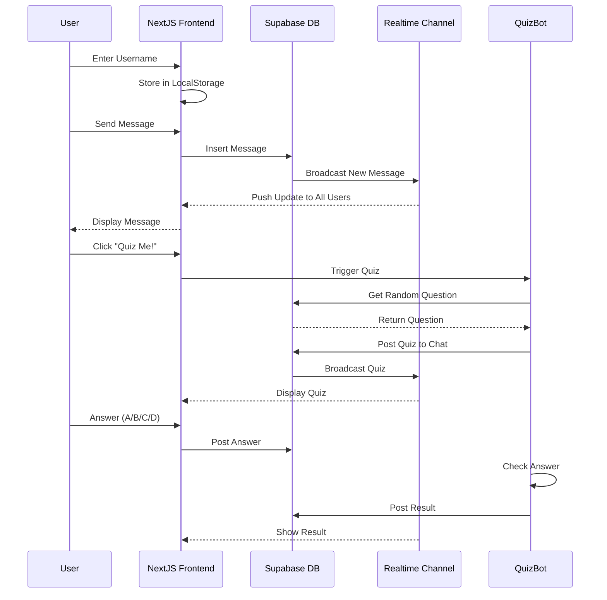

# Chat App - Real-time Messaging

A simple, modern real-time chat application built with Next.js 15, TypeScript, Tailwind CSS, and Supabase.

## Purpose of the Service

This chat application provides a real-time messaging platform where users can:
- Join instantly by entering a username (no authentication required)
- Send and receive messages instantly with real-time updates
- View chat history
- See who sent each message with timestamps
- **Play interactive quizzes** with a built-in Quiz Bot 🤖
- Answer trivia questions from multiple categories

## Position in the Landscape



## Features

- **Real-time Messaging**: Messages appear instantly for all users using Supabase Realtime subscriptions
- **Simple Username Entry**: No sign-up required - just enter a name and start chatting
- **Interactive Quiz Bot** 🤖: Built-in bot that posts trivia questions
  - 10+ sample questions across multiple categories
  - Auto answer checking
  - Instant feedback on correct/incorrect answers
  - Beautiful gradient UI for bot messages
- **Modern UI**: Clean, responsive design with Tailwind CSS
- **Message History**: Persistent storage of all messages with timestamps
- **Row Level Security**: Supabase RLS policies ensure data security

## Tech Stack

- **Frontend**: Next.js 15 (App Router), React, TypeScript
- **Styling**: Tailwind CSS
- **Database**: Supabase (PostgreSQL)
- **Authentication**: Supabase Auth
- **Real-time**: Supabase Realtime

## Prerequisites

- Node.js 18+ installed
- A free Supabase account ([sign up here](https://supabase.com))

## Setup Instructions

### 1. Create a Supabase Project

1. Go to [https://supabase.com/dashboard](https://supabase.com/dashboard)
2. Click "New Project"
3. Fill in your project details and create the project
4. Wait for the project to be provisioned (takes ~2 minutes)

### 2. Set Up the Database

1. In your Supabase dashboard, go to **SQL Editor**
2. Open the `supabase-schema.sql` file in this project
3. Copy the entire SQL content and paste it into the SQL Editor
4. Click "Run" to execute the SQL
5. Verify that the `profiles` and `messages` tables are created (check the **Table Editor**)

### 3. Configure Environment Variables

1. In your Supabase dashboard, go to **Settings** → **API**
2. Copy your **Project URL** and **anon/public key**
3. Create a `.env.local` file in the project root:

```bash
NEXT_PUBLIC_SUPABASE_URL=your-project-url-here
NEXT_PUBLIC_SUPABASE_ANON_KEY=your-anon-key-here
```

Replace the placeholder values with your actual Supabase credentials.

### 4. Install Dependencies and Run

```bash
# Install dependencies
npm install

# Run the development server
npm run dev
```

Open [http://localhost:3000](http://localhost:3000) in your browser.

## Usage

### Getting Started

1. Enter your desired username (2-30 characters)
2. Click "Start Chatting"
3. Your username is saved in browser localStorage for convenience

### Sending Messages

1. After signing in, you'll see the chat room
2. Type your message in the input field at the bottom
3. Click "Send" or press Enter
4. Your message will appear on the right side (your messages are blue)
5. Other users' messages appear on the left side (gray)

### Real-time Updates

- Messages from other users appear automatically without refreshing
- The chat scrolls to the latest message automatically
- Timestamps show when each message was sent

### Using the Quiz Bot

1. Click the **"🤖 Quiz Me!"** button in the header
2. The bot will post a random trivia question with 4 options (A, B, C, D)
3. Type your answer (just the letter: A, B, C, or D)
4. The bot automatically checks your answer and responds with the result!

Quiz questions cover multiple categories:
- 🌍 Geography
- 🔬 Science
- 🎨 Art
- ➗ Mathematics
- 📜 History
- 📚 Literature

You can add more questions directly in the Supabase database! See **QUIZ-BOT-GUIDE.md** for details.

## Design Choices

### Supabase as Backend

**Why Supabase?**
- **Free tier available**: Perfect for small applications and demos
- **Built-in real-time**: PostgreSQL with real-time subscriptions eliminates need for WebSocket infrastructure
- **Integrated authentication**: Full auth system without building custom backend
- **Row Level Security**: Database-level security policies for data protection
- **Low latency**: Direct database connections from the client with secure policies

**Trade-offs**:
- Vendor lock-in to Supabase platform
- Less control over authentication flow compared to custom solution
- Client-side database queries (though secured by RLS)

### Client-Side Data Fetching

Messages and authentication state are managed client-side using React hooks and Supabase client library, rather than Next.js server components.

**Why?**
- **Real-time subscriptions**: Supabase Realtime works seamlessly with client-side hooks
- **Simpler state management**: Auth state and messages update dynamically without server-side session handling
- **Faster interactions**: Direct client-to-database communication with RLS reduces server round trips

**Trade-offs**:
- Increased client bundle size
- Less SEO-friendly (but not critical for a chat app behind authentication)

### Single Chat Room

The app implements a single global chat room rather than multiple rooms or direct messages.

**Why?**
- **Simplicity**: Demonstrates core real-time messaging without complex routing logic
- **Lower complexity**: No need for room management, permissions, or user discovery features
- **Educational focus**: Makes the codebase easier to understand and extend

## Business Logic

### Message Broadcasting

When a user sends a message:
1. The message is inserted into the `messages` table with the user's ID and username
2. Supabase Realtime detects the INSERT operation
3. All connected clients subscribed to the `messages` channel receive the new message
4. Each client's UI updates automatically to display the new message

### Authentication Flow

**Sign Up**:
1. User submits username, email, and password
2. Supabase Auth creates a new user account
3. A corresponding profile record is created in the `profiles` table
4. User receives email confirmation link (required in production)
5. After confirmation, user can sign in

**Sign In**:
1. User submits email and password
2. Supabase Auth validates credentials
3. Session token is stored in local storage
4. App redirects to chat room with user context

### Row Level Security

The database enforces security at the row level:
- **Profiles**: Users can view all profiles but only modify their own
- **Messages**: Anyone can read messages; only authenticated users can insert messages linked to their user ID
- This ensures users cannot impersonate others or modify messages they didn't send

## Project Structure

```
chat-app/
├── app/
│   ├── layout.tsx          # Root layout with metadata
│   ├── page.tsx            # Main page with username/chat routing
│   └── globals.css         # Global styles
├── components/
│   ├── UsernameForm.tsx    # Simple username entry form
│   └── ChatRoom.tsx        # Main chat interface with quiz bot button
├── lib/
│   ├── supabase.ts         # Supabase client and types
│   └── quizBot.ts          # Quiz bot logic and functions
├── supabase-schema.sql     # Database schema (messages + quiz_questions)
├── QUIZ-BOT-GUIDE.md       # Detailed quiz bot documentation
├── REALTIME-SETUP.md       # Real-time troubleshooting guide
├── .env.local              # Environment variables (create this)
└── README.md               # This file
```

## Non-Functional Requirements

### Performance Efficiency

- **Initial Load**: < 2 seconds for authenticated users on standard broadband
- **Message Latency**: < 500ms from send to display for all users (depends on Supabase region)
- **Client Memory**: Messages limited to most recent 100 to prevent memory bloat

### Reliability

- **Data Persistence**: All messages stored in PostgreSQL with ACID guarantees
- **Real-time Resilience**: Automatic reconnection if WebSocket connection drops
- **Auth Session**: 1 hour default session timeout with automatic refresh

### Security

- **Authentication**: Supabase Auth with email/password (can be extended to OAuth)
- **Authorization**: Row Level Security policies enforce data access rules at database level
- **Data in Transit**: All connections use HTTPS/WSS (TLS)
- **Password Storage**: Bcrypt hashing handled by Supabase Auth

### Scalability

- **Current Capacity**: Free Supabase tier supports up to 500MB database, 50,000 monthly active users
- **Scaling Path**: Upgrade to Supabase Pro for dedicated resources, higher limits
- **Real-time Connections**: Free tier supports 200 concurrent real-time connections

### Compatibility

- **Browsers**: Modern browsers (Chrome, Firefox, Safari, Edge) with WebSocket support
- **Mobile**: Responsive design works on mobile browsers
- **Node.js**: Requires Node.js 18+ for development

## Extending the App

### Add Private Messaging

1. Create a `conversations` table for user-to-user chats
2. Update RLS policies to restrict message visibility by conversation participants
3. Add a user list and conversation selector UI

### Add Message Editing/Deletion

1. Add UPDATE and DELETE RLS policies to the `messages` table
2. Store `edited_at` timestamp for edited messages
3. Add edit/delete buttons to message UI (only for own messages)

### Add Rich Media

1. Add a `media_url` column to the `messages` table
2. Implement file upload to Supabase Storage
3. Display images/videos inline in chat

### Add Typing Indicators

1. Use Supabase Realtime Presence feature
2. Broadcast typing state when user starts typing
3. Display "User is typing..." indicator

## Troubleshooting

### "Invalid API key" error

- Double-check your `.env.local` file has the correct `NEXT_PUBLIC_SUPABASE_URL` and `NEXT_PUBLIC_SUPABASE_ANON_KEY`
- Make sure the environment variables are prefixed with `NEXT_PUBLIC_`
- Restart the development server after changing `.env.local`

### Email confirmation not received

- Check your spam folder
- In development, you can disable email confirmation in Supabase dashboard: **Authentication** → **Settings** → Disable "Enable email confirmations"

### Messages not appearing in real-time

- Verify the `supabase-schema.sql` was executed successfully
- Check that the realtime publication was created: `ALTER PUBLICATION supabase_realtime ADD TABLE messages;`
- In Supabase dashboard, go to **Database** → **Replication** and verify `messages` table is enabled

### Build errors

- Delete `node_modules` and `.next` folders
- Run `npm install` again
- Ensure you're using Node.js 18 or higher

## License

MIT

## Contributing

This is a demo/learning project. Feel free to fork and extend it for your own use!
