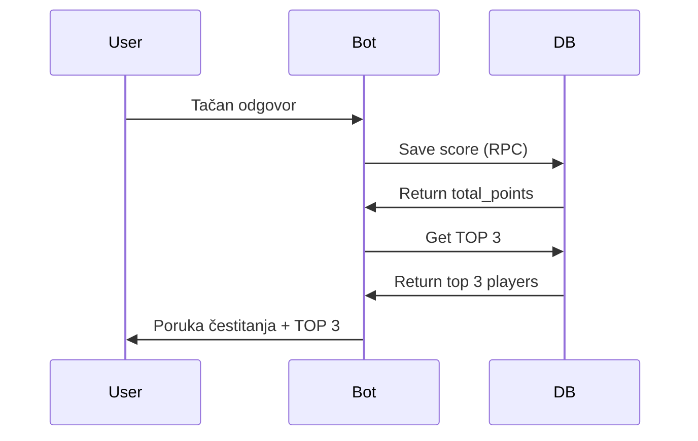

# 🏆 TOP 3 Leaderboard u Poruci Čestitanja

## 📝 Šta je Dodato

Nakon svakog tačnog odgovora, bot sada prikazuje **TOP 3 igrače** direktno u poruci čestitanja!

## ✨ Nova Funkcionalnost

### Poruka Čestitanja sa TOP 3

```
🎉 Bravo, marko! Dobili ste 3 poena! 🏆
💯 Ukupno: 32 poena!

🏆 TOP3:
🥇 marko: 32 poena
🥈 ana: 28 poena
🥉 jovan: 15 poena
```

### Format

- **Prva linija**: Čestitka + osvojeni poeni
- **Druga linija**: Ukupan broj poena
- **Treća linija**: Prazan red
- **Četvrta linija**: "🏆 TOP3:"
- **Sledeće 3 linije**: Top 3 igrača sa medalјama

## 🔧 Tehničke Izmene

### Nova Funkcija - `getTop3Message()`

**`lib/quizBot.ts`**:
```typescript
// Get formatted TOP 3 message
async function getTop3Message(): Promise<string> {
  try {
    const top3 = await getLeaderboard(3);
    
    if (top3.length === 0) {
      return '';
    }
    
    const medals = ['🥇', '🥈', '🥉'];
    const lines = top3.map((player, index) => {
      return `${medals[index]} ${player.username}: ${player.total_points} poena`;
    });
    
    return `\n\n🏆 TOP3:\n${lines.join('\n')}`;
  } catch (error) {
    console.error('Error getting TOP3:', error);
    return '';
  }
}
```

### Ažurirana Poruka Čestitanja

**Pre**:
```typescript
await postBotMessage(
  `🎉 Bravo, ${username}! Dobili ste ${points} poena! 🏆\n💯 Ukupno: ${totalScore} poena!`
);
```

**Posle**:
```typescript
// Get TOP 3 leaderboard
const top3Message = await getTop3Message();

await postBotMessage(
  `🎉 Bravo, ${username}! Dobili ste ${points} poena! 🏆\n💯 Ukupno: ${totalScore} poena!${top3Message}`
);
```

### Uklonjena `hint` Referenca

Takođe sam uklonio referencu na `question.hint` iz formatiranja pitanja pošto smo obrisali hint kolonu:

**Pre**:
```typescript
const quizMessage = `
📚 **${question.category}**

${question.question}

${question.hint ? `💡 Hint: ${question.hint}` : ''}

Napiši tačan odgovor! ✍️
`.trim();
```

**Posle**:
```typescript
const quizMessage = `
📚 **${question.category}**

${question.question}

Napiši tačan odgovor! ✍️
`.trim();
```

## 🎨 Dizajn

### Medalje

| Pozicija | Emoji | Naziv |
|----------|-------|-------|
| 1. mesto | 🥇 | Zlatna medalja |
| 2. mesto | 🥈 | Srebrna medalja |
| 3. mesto | 🥉 | Bronzana medalja |

### Format Teksta

```
🥇 marko: 32 poena
🥈 ana: 28 poena
🥉 jovan: 15 poena
```

- **Emoji medalje**: Vizualno privlačno
- **Username**: Ime igrača
- **Broj poena**: Total points
- **Gramatika**: Automatski "poen" ili "poena"

## 📱 Primeri Poruka

### Scenario 1: Igrač je #1

```
🎉 Bravo, marko! Dobili ste 3 poena! 🏆
💯 Ukupno: 32 poena!

🏆 TOP3:
🥇 marko: 32 poena
🥈 ana: 28 poena
🥉 jovan: 15 poena
```

### Scenario 2: Igrač je #2

```
🎉 Bravo, ana! Dobili ste 2 poena! 🥈
💯 Ukupno: 30 poena!

🏆 TOP3:
🥇 marko: 32 poena
🥈 ana: 30 poena
🥉 jovan: 15 poena
```

### Scenario 3: Novi Igrač (Nije u TOP 3)

```
🎉 Bravo, novi! Dobili ste 1 poen! 🥉
💯 Ukupno: 1 poen!

🏆 TOP3:
🥇 marko: 32 poena
🥈 ana: 30 poena
🥉 jovan: 15 poena
```

### Scenario 4: Samo 2 Igrača

```
🎉 Bravo, marko! Dobili ste 3 poena! 🏆
💯 Ukupno: 35 poena!

🏆 TOP3:
🥇 marko: 35 poena
🥈 ana: 28 poena
```

### Scenario 5: Prvi Igrač Ever

```
🎉 Bravo, prvi! Dobili ste 3 poena! 🏆
💯 Ukupno: 3 poena!

🏆 TOP3:
🥇 prvi: 3 poena
```

## 🔄 Kako Radi

### Flow Chart



### Kod Flow

1. **Korisnik odgovori tačno**
2. **Sačuva se skor** → `saveUserScore(username, points)`
3. **Vraća se total_points**
4. **Dohvati se TOP 3** → `getTop3Message()`
5. **Formatira se poruka** → Čestitka + Ukupno + TOP 3
6. **Pošalji poruku** → `postBotMessage()`

## 📊 Prednosti

✅ **Instant Feedback** - Korisnik vidi gde stoji u odnosu na druge
✅ **Motivacija** - Vidi ko je ispred i koliko mora da osvoji da bi ih prešao
✅ **Takmičarski Duh** - Podstiče igrače da nastave da igraju
✅ **Transparentnost** - Jasno prikazan ranking bez otvaranja leaderboard-a
✅ **Manje Klikova** - Nema potrebe da otvara leaderboard modal za osnovne informacije

## 🎯 User Experience

### Motivacija za Igrače

**Ako si #1:**
- "Odličan sam! Moram da održim poziciju!"

**Ako si #2:**
- "Vidim da mi treba još X poena da pređem #1!"

**Ako si #3:**
- "Blizu sam! Još malo pa sam u TOP 2!"

**Ako nisi u TOP 3:**
- "Vidim ko je u TOP 3, moram da igram bolje!"

### Real-time Updates

Pošto se TOP 3 dohvata nakon svakog odgovora:
- ✅ Uvek je aktuelan
- ✅ Odmah vidiš promene u ranking-u
- ✅ Ako pređeš nekog, odmah se vidi

## 🧪 Testiranje

### Test Case 1: Solo Igrač
```
🏆 TOP3:
🥇 solo: 3 poena
```

### Test Case 2: Dva Igrača
```
🏆 TOP3:
🥇 prvi: 10 poena
🥈 drugi: 5 poena
```

### Test Case 3: Tri+ Igrača
```
🏆 TOP3:
🥇 prvi: 32 poena
🥈 drugi: 28 poena
🥉 treći: 15 poena
```

### Test Case 4: Isti Broj Poena
```
🏆 TOP3:
🥇 marko: 30 poena
🥈 ana: 30 poena
🥉 jovan: 25 poena
```
*Sortira se po username-u ako su poeni isti (PostgreSQL default)*

## 📦 Performance

### Database Queries

**Prethodno** (2 queries):
1. Save score → RPC
2. Get TOP 3 → SELECT

**Sada** (2 queries, ali optimizovano):
1. Save score + return total → RPC
2. Get TOP 3 → SELECT (limit 3, indexed)

### Optimizacija

- ✅ Index na `total_points DESC` (već postoji)
- ✅ LIMIT 3 (brz query)
- ✅ Keširanje nije potrebno (real-time podaci)

## 🔄 Commit

```bash
git commit -m "Add TOP 3 leaderboard to congratulations message"
git push origin main
```

**Status**: ✅ Pushed na GitHub (`main` branch)

---

**Implementirano**: 10. Nov 2025  
**Razlog**: Motivacija igrača i instant ranking feedback  
**Dodatni Benefit**: Uklonjena `hint` referenca iz koda  
**Performance**: Optimizovano sa LIMIT 3 i index-om

